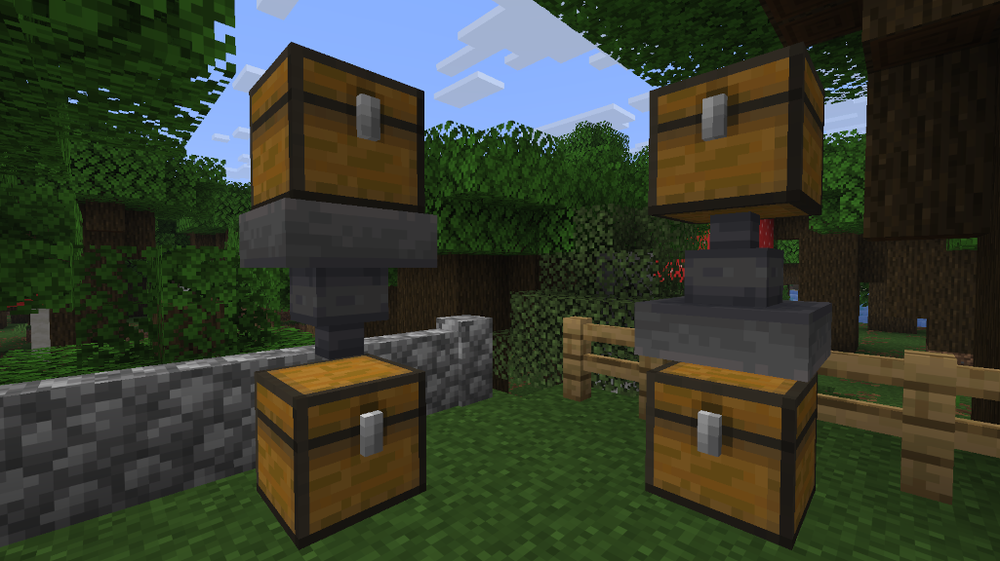

# Hopper Upper

A Fabric mod that lets hoppers be placed pointing up.

## How It Works

Place a hopper while targeting the **bottom face** of a block (looking up) and it becomes an upward hopper. No separate item or recipe needed.

- Place hopper targeting bottom face → Upward Hopper
- Place hopper targeting any other face → Normal Hopper
- Breaking an upward hopper drops a regular hopper

## Features

- **No new item** - uses the vanilla hopper item, no crafting needed
- Full hopper functionality:
  - 5-slot inventory with hopper GUI
  - Redstone control (disable with a signal)
  - Item entity collection from below
  - Comparator output support
  - Waterlogging

## Behavior

The Upward Hopper reverses normal hopper behavior:
- **Pulls items from below** (block or item entities)
- **Pushes items upward** to the block above

Useful for item elevators and vertical item transport.

## Requirements

- Targets the Minecraft, Fabric Loader, and Fabric API versions declared in this mod's `gradle.properties`. Check there for the exact currently-supported version
- Java version as declared in `fabric.mod.json`'s `depends` block
- Pandorical (see below)

## Pandorical

This mod is server-side only (`"environment": "server"` in `fabric.mod.json`) and registers the Upward Hopper's block and item models/textures through Pandorical's content sync so the custom block renders correctly for connecting clients.

**The Pandorical mod must be installed client-side** for players to see the Upward Hopper's textures and model. Without it, the block still functions but a connecting client cannot see it rendered correctly.

## Installation

Install alongside its declared dependencies (see `fabric.mod.json`), including Pandorical on connecting clients.

## License

MIT
